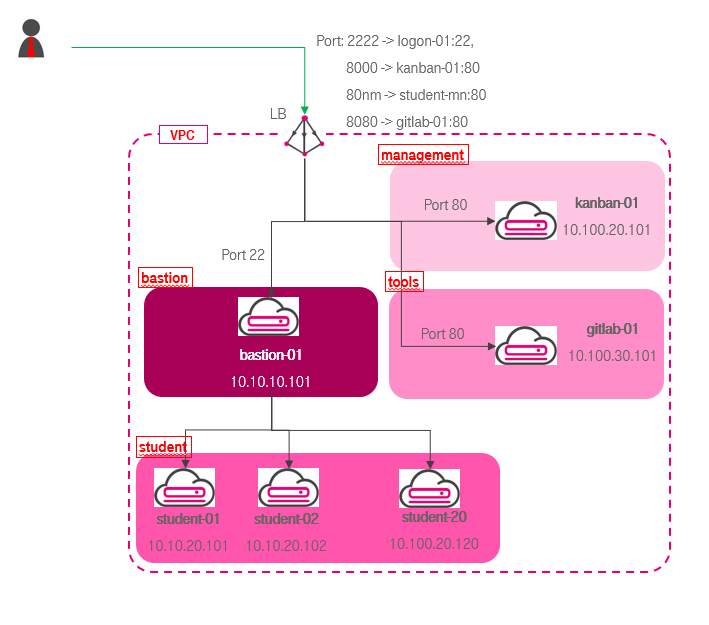
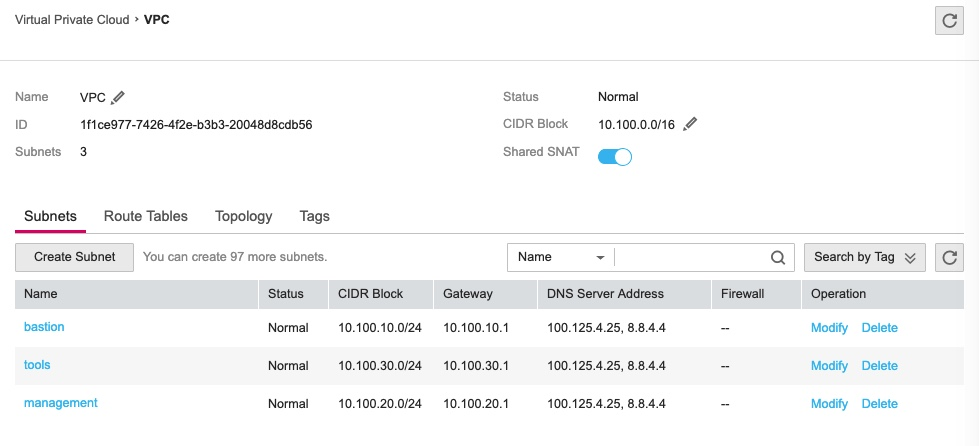
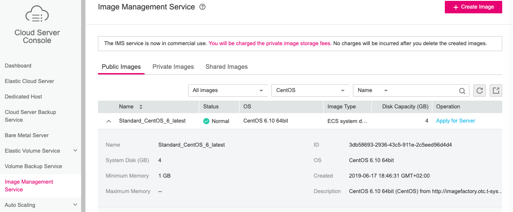
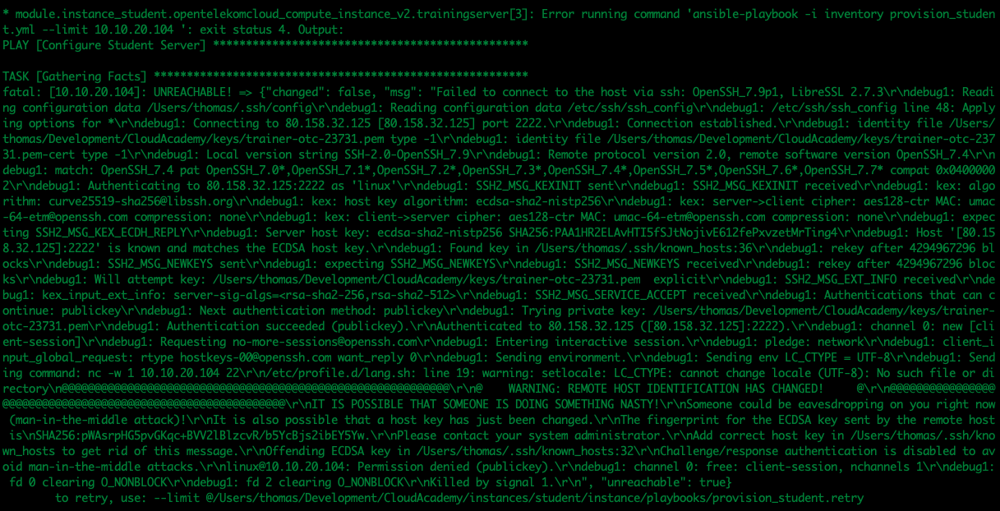

# Training Environment
 
## Introduction
This Terraform script generates an OTC environment for a classroom based PaaS training. The training explains the basics of
- OTC (Open Telekom Cloud)
- Docker
- Kubernetes
- AppAgile (Openshift)
- Cloud Foundry
- Rancher (1.x and 2.x)

Besides the technical view, fundamentals of IaaS and PaaS architecture and "12 Factor Apps" are presented.
Several exercises show how to constuct a cloud native application on a PaaS plattform. For a deep understanding, fundamentals of cloud software architecture like "Pet and Cattle" princible, "Conway's Law" and "12 Factor Apps" are explained.

The first part of this readme file explains how to use the IaC Script. The second part shows some Terraform hacks to assist in writing your own Terraform scripts. The last part of this file refers to some usefull sources of information.   

Note that the resources installed with this script are note hardened. You should not use these scripts for a productive environment! 

Terrafrom 0.11.13 and Ansibe 2.8.2 was used.

The environment enables the students to work on the pruposed exercises. The environment will be created with several Infrastructure as Code scripts:
1. Generate an Identity Project 
2. Generate the Network Environment
3. Generate a Bastion Host with a connection into the Internet via a Loadbalancer
4. Generate a Kanban Board (http://kanbanik.github.io/kanbanik/) with a Loadbalancer Connection into the Internet
5. Generate Student Servers 
6. Generate a Gitlib Server



Part 1, 2 and 3 are mandatory for all further parts and should be executed before anything else in that Sequence. After these Installations, the Parts 4 - 6 can be used when ever needed. 

The Open Telekom Cloud (OTC) environment is produced with Terraform. The Elastic Cloud Servers (ECS) are configured with Ansible. Ansible is called by Terraform during the generation of the hosts.

The structure of Terraform follows the principle "Divide and Conquer". Unlike the most propagated form, each Userstory has it's own "Branch" (see https://en.wikipedia.org/wiki/Conway%27s_law). All communication will be centrally routed through a single Loadbalancer. All ssh-connectivity will be routed over a Bastion host. 

## Preparation
First of all, the logon credentials to the OTC have to be given. Best praxis is to generate a "environment.sh" file:

```
  # Logon Credentials OTC
  #######################
  export OS_AUTH_URL="https://iam.eu-de.otc.t-systems.com/v3"
  export OS_USERNAME="<Your Username>"
  export OS_PASSWORD="<Your Password>"
  export OS_DOMAIN_NAME="<Your OTC Tenant>"
  export OS_TENANT_NAME="eu-de_Cloud-Test"
  export TF_LOG="ERROR"

  # Vars to execute curl Rest API Requests
  ########################################
  export TF_VAR_username=$OS_USERNAME
  export TF_VAR_password=$OS_PASSWORD
  export TF_VAR_domain_name=$OS_DOMAIN_NAME
  export TF_VAR_tenant_name=$OS_TENANT_NAME
  export TF_VAR_endpoint=$OS_AUTH_URL
```

As a second step, the Logon Certificates have to be created and places into the subdirectory ./keys. At least the following certificates have to be defined:
  - bastion.pem
  - bastion.pub
  - kanban.pem
  - kanban.pub
  - student.pem
  - student.pub
  - gitlab.pem
  - gitlab.pub

To prevent any change within the Terraform and Ansible Coding, don't change the naming.

As a thrid step, ensure that "terraform", "ansible" and "jp" is installed on the mashine the provisioning is executed from. 

## Identity Project
Subdirectory: ./global

### Creating
Usage: 
```
  > terraform init
  > terraform plan -no-color
  > terraform apply --auto-approve -no-color
```
With the execution of these commands, a IAM Project "thw-project" is generated. The project has limited default quotas. To increase the quota, contact the Support Team. 

### Deleting
The Identity Project can't be deleted by a "terraform destroy". It can only be deleted with the help of the Userinterface https://console.otc.t-systems.com/console/. Choose "Identity and Access Management"->"Projects"->"+"->"eu-de_Cloud-Test" and press the "Delete" Link at the End of the Line. After preventing the asked Information in the Popup, the Project will be deleted within 24 Hours.   


## Network
Subdirectory: ./network
The created VPC uses a "10.100.0.0" network. The subnets are created in order of the list defined in variables.tf:
```
variable "subnets" {
   type = "list"
   default = ["bastion", "management", "tools", "student"]
}
```
The fist subnet (bastion) gets "10.100.10.0", the second (management) "10.100.20.0",...
 
### Creating
Usage: 
```
  > terraform init
  > terraform plan -no-color
  > terraform apply --auto-approve -no-color
```

A VPC and the necessary subnets are created.


### Deleting
Usage: 
```
  > terraform destroy -no-color --auto-approve
```

The VPC will not be deleted. There seems to be a Bug. 

## Bastion
Subdirectory: ./bastion
This Set of Terraform Files will generate 
- a Security Group 
- an Elastic IP
- a Loadbalancer with a ssh listner on Port 2222 
- a Centos host 
- a backend Server Group with the host assigned to

After creating these objects, Terraform will execute an Ansible playbook to configure the generated bastion host (bastion/ansible/playbook.yml). 

To access the bastion host as an administrator, use the bastion.pem certificate:
```
ssh linux@80.158.42.120 -p 2222 -i keys/bastion.pem
```
Students can access their account with the student.pem certificate:
```
ssh student01@80.158.42.120 -p 2222 -i keys/student.pem
```

### Creating
Usage: 
```
  > terraform init
  > terraform plan -no-color
  > terraform apply --auto-approve -no-color
```

### Deleting
Usage: 
```
  > terraform destroy -no-color --auto-approve
```
Beause this Part generates EIP and Loadbalancer used by the following Parts, the Deletion is only possible, if the other Parts (Kanban, Student or Gitlab Hosts) have been deleted. Otherwise the Deletion of the Loadbalancer will never end. 

## Kanbanik Board
Subdirectory: ./kanban
This Set of Terraform Files will generate 
- a Security Group 
- a Loadbalancer listner on Port 8000
- a Centos host 
- a backend Server Group which the host is assigned to

After creating these objects, Terraform will execute an Ansible playbook to configure the Kanban host (kanban/ansible/playbook.yml). During the configuration, Docker will be installed. Kanbanik Docker images will be pulled and started.

More information about the installed Software can be found here: https://github.com/kanbanik/kanbanik/wiki/Installation-Guide

### Creating
Usage: 
```
  > terraform init
  > terraform plan -no-color
  > terraform apply --auto-approve -no-color
```

### Deleting
Usage: 
```
  > terraform destroy -no-color --auto-approve
```

## Gitlab
Subdirectory: ./gitlab
This Set of Terraform Files will generate 
- a Security Group 
- a Loadbalancer Listner on Port 8080
- a Centos Host 
- a Backend Server Group which the host is assigned to

After creating these objects, Terraform will execute an Ansible Playbook to configure the Gitlab host (gitlab/ansible/playbook.yml). During the configuration, Docker will be installed. Gitlab Docker Images will be pulled and started. 

More Information about the installed Software can be found here: https://docs.gitlab.com/ee/install/docker.html

### Creating
Usage: 
```
  > terraform init
  > terraform plan -no-color
  > terraform apply --auto-approve -no-color
```

### Deleting
Usage: 
```
  > terraform destroy -no-color --auto-approve
```

## Student Server
Subdirectory: ./student
During the training the handling of Docker, git and various PaaS environments (e.g. k8s, Openshift, Rancher, PCF,...) should be taught. The student server is used to do some exercises.
All students should have their own server. To specify how many servers should be created, change in variables.tf 
```
variable "instance_count" {
   default = "11"
} 
```
to your desired value. Please be sure, that the project quota is sufficient for the creation of the hosts. 

This set of Terraform Files will generate 
- a Security Group 
- A Loadbalancer listner for each host listening on Port 80<xy>
- Several Centos hosts
- Backend Server Group for each Centos host

After creating these Objects, Terraform will execute an Ansible Playbook (student/ansible/playbook.yml). During the configuration, Docker will be installed. A first repository to explain the usage of Docker will be cloned. 

Since the servers have no direct Internet Connection, a login should be done from bastion host. 
```
ssh student@10.100.40.101 -i ~/.ssh/...
```

### Creating
Usage: 
```
  > terraform init
  > terraform plan -no-color
  > terraform apply --auto-approve -no-color
```

### Deleting
Usage: 
```
  > terraform destroy -no-color --auto-approve
```

# Provisioning Hacks
This Section lists some hacks to make use of Terraform and Ansible on the OTC.

## Multitenant 
If the Provisioning of the Code has to be done over several tenants or even Clouds, Terraform provides a possibility to do that within a single script in a simple way.
For each Tenanat, a provider has to be defined:
```
# Tenant 1
provider "opentelekomcloud" {
  alias       = "tenant1"
  user_name   = "<username>"
  password    = "<Top Secret>"
  domain_name = OTC-EU-DE-000000000010000xxxxx"
  tenant_name = "eu-de"
  region      = "eu-de"
}

# Tenant 2
provider "opentelekomcloud" {
  alias       = "tenant2"
  user_name   = "<username>"
  password    = "<Top Secret>"
  domain_name = OTC-EU-DE-000000000010000yyyyy"
  tenant_name = "eu-de_MyProject"
  region      = "eu-de"
}
```
To switch between both Provider definitions, reference the desired Provider e.g. in a module call:
```
        source = "logon/network"
        providers = {
           opentelekomcloud = "opentelekomcloud.tenant2"
        }
        vpc_id     = "${data.opentelekomcloud_vpc_subnet_v1.subnet_logon.vpc_id}"
        subnet_id...
```

## Project Quota on OTC
After the creation of a project, the quota of that project is set to default values. These will restrict the resoure consumption of that project. 
To fire up e.g. more than 10 VMs, the quota must be exceeded. Please create a support ticket, including the tenant and project details, to make this change. 

## Network Environment with Provider "opentelekomcloud"
Using the Terraform Open Telekom Cloud Provider, subnets can be created with the help of two modules:
- opentelekomcloud_networking*
- opentelekomcloud_vpc*

The first command group "opentelekomcloud_networking*" creates a subnet. This is not assigned to a VPC. A router must be defined manually. In the router definition the "SNAT" flag can be set to "yes". A routing from internal to Internet is possible.
The second command group can be used to create a VPC and its subnets. A router is configured automatically. SNAT is set with the shared parameter of the VPC ressource. 

## Instance with fixed Disk Size
To create a non standard disk size instance, a volume has to be created before starting an instance. Since that volume should be bootable, the ID of the image to boot from is needed. This ID can seen in the "Image Management Service"

or can be looked up with Terraform: 
```
data "opentelekomcloud_images_image_v2" "image_centos" {
  name = "Standard_CentOS_7_latest"
  most_recent = true

  properties = {
    key = "value"
  }
}
```
The volume will be created with the image as a Source:
```
resource "opentelekomcloud_blockstorage_volume_v2" "volume" {
  count = "${var.instance_count}"
  name = "${var.instance_name_prefix}-${format("%02d", count.index+1)}"
  size  = "10"
  image_id = "${data.opentelekomcloud_images_image_v2.image_centos.id}"
}
```
After creation, an instance can be build based on that volume:
```
resource "opentelekomcloud_compute_instance_v2" "instance" {
  count           = "${var.instance_count}"
  name            = "${var.instance_name_prefix}-${format("%02d", count.index+1)}"
  image_name      = "${var.image_name}"
  flavor_name     = "${var.flavor_name}"
  key_pair        = "${var.keypair_name}"
  security_groups = [
    "${var.secgrp_name}"
  ]

  block_device {
    uuid                  = "${element(opentelekomcloud_blockstorage_volume_v2.volume.*.id, count.index)}"
    source_type           = "volume"
    boot_index            = 0
    destination_type      = "volume"
    delete_on_termination = true
  }

  network {
    uuid           = "${var.network_id}"
    fixed_ip_v4    = "10.100.30.10${format("%d", count.index+1)}"
  }
}
```
The compleate Coding can be found in "gitlab/instance".

## Terraform Module and Ressource Dependency
Terraform will generate an execution plan for generating all objects in the OTC. Terraform tries to create as many objects as possible in parallel. That isn't wanted all the time. For instance, the Configuration of Hosts need a working ssh connection through a Bastion Host. This Bastion Host must be reachable before Ansible starts to work. 
To prevent maximal parallelism, Terraform uses dependencies. 
Regrettably, Terraform can only definie dependencies between resources. Modules don't have a dependency parameter. To define a dependency between a Module A and a Module B, the following workaround can be used:

Define an output variable in Module A:

```
…
output “admin_state_up” {
   value = “${opentelekomcloud_lb_member_v2.member.admin_state_ip}”
}
...
```
The calling Terraform file can now use the variable within the call of Module B:
```
module "B" {
...
  variable_dependency = "${module.A.admin_state_up}"
...
}
```
That variable "variable_dependency" must be defined as a input variable of Module B:
```
...
variable "variable_dependency" {
        description = "Variable to synchrinize with Module A"
}
...
```
This variable will be used within the definition of Module B: 
```
resource "null_resource" "logon_ready" {
  triggers = {
    depend = "${var.variable_dependency}"
  }

resource "opentelekomcloud_compute_instance_v2" "trainingserver" {
  depends_on       = ["null_resource.logon_ready"]
  count           = "${var.instance_count}"
  name            = "${var.instance_name_prefix}-${format("%02d", count.index+1)}"
...

```
The resource "trainingserver" will be created, if the resourece "logon_ready" is set. But this resource is only set, if the trigger with the variable have been called.

With that workaround, the Execution Plan of Terraform has been changed. 


## Terraform Parallelism
It is possible to restict the parallelism of Terraform with the help of a parameter when applying Terraform:
```
terraform apply --auto-approve -no-color -parallelism=10
```

## Missing Terraform Data Sources
The shown example is splitted into several parts. This lead to the disadvantage of not having all information about previosly generated ressources available. It is possible to fetch these information with the help of Terraform Data Sources. Regettably not all needed Data Sources are defined. 
Example:
The Loadbalancer is generated in the Bastion Host Section. When executing the Kanban Host Section, the ID of the Loadbalancer is needed to generate an additional listner. The information is missing, a Data Source isn't availible. 
  
To fetch the ID, the OTC API (https://docs.otc.t-systems.com/) will be called by Terraform with the help of a shell Script:
```
#!/bin/bash
#set +e
set +x

eval "$(jq -r '@sh "OTC_MYUSER=\(.username) OTC_MYPW=\(.password) OTC_MYDOMAIN=\(.domain) OTC_MYPROJECTID=\(.project)" ')"

function check_deps() {
  test -f $(which jq) || error_exit "jq command not detected in path, please install it"
}


function jsonValue() {
  KEY=$1
  num=$2
  awk -F"[,:}]" '{for(i=1;i<=NF;i++){if($i~/'$KEY'\042/){print $(i+1)}}}' | tr -d '"' | sed -n ${num}p
}

function get_login_token() {
  # Project ID
  OTC_MYTENANTID=$OTC_MYPROJECTID


  REQ_AUTH_TOKEN='{
    "auth": {"identity": {"methods":["password"],
    "password":{"user":
    {"name": "'$OTC_MYUSER'"
    ,"password": "'$OTC_MYPW'"
    ,"domain":{"name": "'$OTC_MYDOMAIN'"}}}},
    "scope": {"project": {"name": "'$OTC_MYPROJECTID'"}}}
  }'

# Get Token
  export TOKEN=`curl -si -d "$REQ_AUTH_TOKEN" -H "Content-type: application/json" https://iam.eu-de.otc.t-systems.com/v3/auth/tokens | awk '/X-Subject-Token/ {print$2}'`

}


function get_loadbalancerId() {
  # Get LB Ids
  BASE_URL="https://elb.eu-de.otc.t-systems.com"
  REQ_URL="$BASE_URL/v2.0/lbaas/loadbalancers"
  RES=`curl 'Accept:application/json' -H 'Content-Type:application/json' -H "X-Auth-Token:$TOKEN" -X GET "$REQ_URL" 2>/dev/null | jsonValue id 2`

  echo "{\"lbid\" : \"${RES//[[:blank:]]/}\"}" | sed -e 's/^[[:space:]]*//'
  #jp -n --arg lbId "$RES" '{"lbid":$lbId}'
}

check_deps && \
get_login_token && \
get_loadbalancerId
```
To prevent to install the OTC Command Line Tools on the Terraform mashine, this script uses curl. 
Execution this script in a Command Line will return a JSON with the ID of the Loadbalancer. If you try that, please set the needed environment variables.
The script is called by Terraform before a new listner will be generated. 
```
# Loadbalaner to Internet
#

data "external" "elb" {
  program = ["bash", "${path.module}/get_elb.sh"]
  query = {
    username="${var.username}"
    password="${var.password}"
    domain="${var.domain_name}"
    project="${var.project_id}"
  }
}

# Create Listner
resource "opentelekomcloud_lb_listener_v2" "listener" {
  count            = "${var.instance_count}"
  name             = "${var.instance_name_prefix}-listener}"
  protocol         = "TCP"
  protocol_port    = "8000"
  loadbalancer_id  = "${data.external.elb.result.lbid}"
  admin_state_up   = "true"
}
...
```
With this workaround all information of an OTC Tenant delivered by the API can be used by Terraform. 

## Ansible Inventory File
To execute Ansible with a connection over a Bastion host, an inventory file is needed:
```
10.100.20.101 ansible_ssh_common_args='-o ProxyCommand="ssh -o StrictHostKeyChecking=no -v %r@80.158.42.120 -p 2222 -i /Users/thomas/Development/ToolChain/kanban/.terraform/modules/078d8ae724acf13e55cafdc4353b88fc/../../keys/bastion.pem nc -w 1 %h %p"'
```
The host definition includes a ssh ProxyCommand with the actual Elastic IP Adress. That is the reason, that this file can't be static and will be generated by Terraform before Ansible is called. 
To produce the Inventory File, a Template File "inventory.tpl" is needed:
```
${ip} ansible_ssh_common_args=\x27-o ProxyCommand=\x22ssh -o StrictHostKeyChecking=no -v %r@${bastion_ip} -p 2222 -i ${bastion_cert_path} nc -w 1 %h %p\x22\x27
```
Since the sting needs diferent quotes, they have been coded in Hex. '\x27' stands for ", '\x22' for '.
In a first step, Terraform reads in the Template File:
```
data "template_file" "inventory" {
  count = "${var.instance_count}"
  template = "${file("${path.module}/templates/inventory.tpl")}"
  vars {
    name  = "${format("kanban%02d", count.index+1)}"
    ip = "${element(var.instance_ips, count.index)}"
    bastion_ip = "${var.public_ip}"
    bastion_cert_path = "${path.module}/../../keys/bastion.pem"
  }
}
```
After that, the Inventory File is created:
```
resource "null_resource" "update_inventory" {
  triggers {
    template = "${data.template_file.inventory.0.rendered}"
  }
  count = "${var.instance_count}"

  # Generate inventory,
  provisioner "local-exec" {
    working_dir = "${path.module}/"
    command = "echo '${join(" ", data.template_file.inventory.*.rendered)}' > ${path.module}/inventory"
  }
}
```
The compleate code can be found in every "ansible" subdirectory. 

## Ansible & Docker
There is an Ansible Module existing to manage docker (https://docs.ansible.com/ansible/latest/modules/docker_container_module.html). Regettably it couldn't be used because of several errors. My assumption is, that it is not tested with Centos. 
For that reason, the Ansible Playbook executes the docker commands with the help of the shell module:
```
     - name: Kanbanik - get the mongodb
       shell: |
         docker pull mongo
       ignore_errors:                no

     - name: Kanbanik - run mongo
       shell: |
         docker run -d \
         -v /data/localdb:/data/db \
         --network=kanbanik_nw \
         --name mongodbserver \
         mongo
       ignore_errors:                no
```
   
## Execution of Ansible
Ansible uses ssh as method to communicate with the remote server. As already discussed in the dependency section, Ansible will be executed by Terraform, only if the dependency is fullfilled. But the dependency could be fullfilled before the host is up and running. To avoid a cancellation of the Ansible script, the communication channel will be tested by a "remote-exec" provisioner. In contrast to the later used "local-exec" provisioner, this provisioner tries several times to execute the given command "uptime". If the command woun't fail, the "local-exec" part, the Ansible call is executed. 
```
resource "null_resource" "execute_ansible" {
  triggers {
    template = "${var.instance_ips[0]}"
  }

  # Wait until Instance is up and running
  provisioner "remote-exec" {
    inline = ["uptime"]
    connection {
      type        = "ssh"
      host        = "${element(var.instance_ips, count.index)}"
      port        = "22"
      user        = "linux"
      agent       = "false"
      private_key = "${file(var.keypair_file_private)}"
      bastion_host = "${var.public_ip}"
      bastion_port = "2222"
      bastion_user = "linux"
      bastion_private_key = "${file(var.keypair_file_private)}"
    }
  }

  # Execute configuration with ansible,
  provisioner "local-exec" {
    working_dir = "${path.module}/"
    command = "ansible-playbook -i inventory playbook.yml --limit ${element(var.instance_ips, count.index)}"
  }
}
```

# Known Errors
This Section describes some known errors during the execution of the scripts and how to solve the situation.

## Ansible Host Key
### Error Description
During the execution of Ansible an error is shown:
```
fatal: [80.158.22.105]: UNREACHABLE! => {
    "changed": false,
    "msg": "Failed to connect to the host via ssh: command-line: line 0: Bad configuration option: -o\r\n",
    "unreachable": true
}
```
or
```
The authenticity of host '[80.158.22.105]:2222 ([80.158.22.105]:2222)' can't be estab-lished.
ECDSA key fingerprint is SHA256:cdCWHnOHV8+B55fP9OLsGSqaOkwVYjWRPIrFEA5i/jY.
Are you sure you want to continue connecting (yes/no)?
```
or
```
PLAY RECAP ***********************************************************************************************************
80.158.22.105              : ok=0    changed=0    unreachable=1    failed=0
PLAY RECAP ***********************************************************************************************************
```

### Reason
Ansible does not establish a connection to the server because the server key was not successfully checked.

### Solution
Specify a flag in "ansible.cfg":
```
[defaults]
Host_key_checking = Flase
```

## Ansible unreachable
### Error Description
If to many servers are started at once, Terraform will throw an error especially during executing Ansible:


### Reason
There could be two Reasons:
- Too low bandwidth when communicating to the Internet.
- Entries in the "known_hosts" file.

### Solution
- Increase the bandwidth in File "bastion/loadbalanceri/eip.tf"
```
# EIP for Loadbalancer
resource "opentelekomcloud_vpc_eip_v1" "eip_lb" {
  publicip {
    type = "5_bgp"
  }
  bandwidth {
    name = "eip_lb"
    size = "50"
    share_type = "PER"
  }
}
```
- Delete the "known_hosts" file.
```
> rm ~/.ssh/known_hosts
```

## Quota Exceeded
### Error Description
When creating the training environment, only 10 instances (1 logon and 9 student servers) are created. When creating another VM, an error message is output that the quota is insufficient.

### Reason
After creating a Project, the default Quota is set to 10 VMs per Project.

### Solution
It is not possible to set the quota with the help of the UI or the Command Line. A higher quota must be requested with a support ticket including tenant ID and project.

# Literature

## OTC
### Terraform Provider
```
URL: https://www.terraform.io/docs/providers/opentelekomcloud/index.html
URL: https://github.com/terraform-providers/terraform-provider-opentelekomcloud
URL: https://github.com/OpenTelekomCloud/terraform-otc
```

### API Description
```
URL: https://open-telekom-cloud.com/en/support/tutorials/automating-opentelekomcloud-apis
URL: https://docs.otc.t-systems.com/
```

## Terraform
```
Title: "Terraform Up & Running"
Author: Brikmann, Y 
Publisher: O'Reilly (2017)
```

Hashicorp - Terraform Provider
```
URL: https://www.terraform.io/docs/providers/ 
```

## Ansible
```
Title: "Ansible Up & Running"
Author: Moser, L.H.
Publisher: O'Reilly (2017)
```


## Kanbanik
Kanbanik Project Page
```
URL: http://kanbanik.github.io/kanbanik/
```

Kanbanik Installation Guide
```
URL: : http://kanbanik.github.io/kanbanik/
```

## Gitlab
Gitlab Project Page
```
URL: https://about.gitlab.com/
```

Gitlab with Docker
```
URL: https://docs.gitlab.com/omnibus/docker/
```


